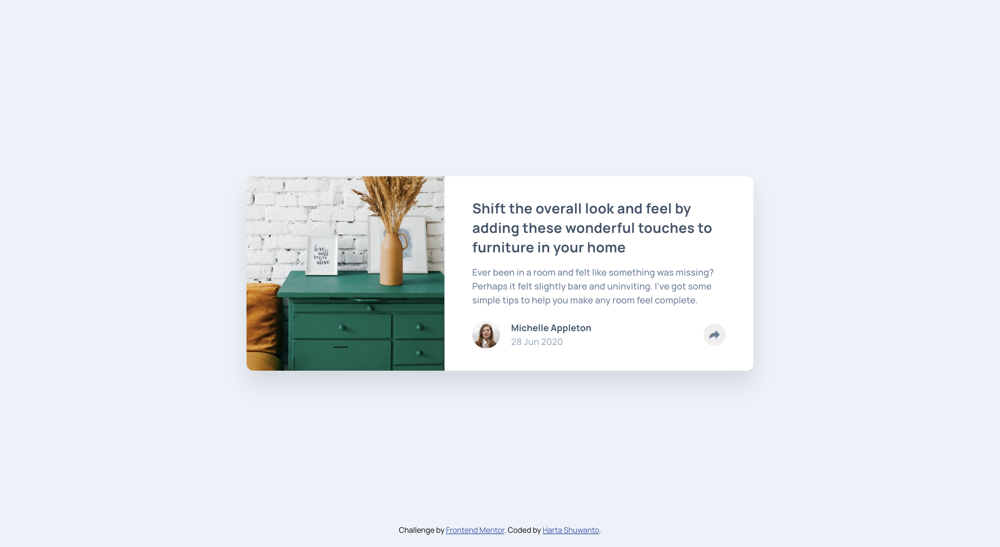

# Frontend Mentor - Article preview component solution

This is a solution to the [Article preview component challenge on Frontend Mentor](https://www.frontendmentor.io/challenges/article-preview-component-dYBN_pYFT). Frontend Mentor challenges help you improve your coding skills by building realistic projects. 

## Table of contents

- [Overview](#overview)
  - [The challenge](#the-challenge)
  - [Screenshot](#screenshot)
  - [Links](#links)
- [My process](#my-process)
  - [Built with](#built-with)
  - [What I learned](#what-i-learned)
  - [Continued development](#continued-development)
  - [Useful resources](#useful-resources)
- [Author](#author)
- [Acknowledgments](#acknowledgments)

## Overview

### The challenge

Users should be able to:

- View the optimal layout for the component depending on their device's screen size
- See the social media share links when they click the share icon

### Screenshot

### Links

- Solution URL: [Github](https://github.com/hartashu/article-preview-component)
- Live Site URL: [Github Pages](https://hartashu.github.io/article-preview-component/)

## My process

### Built with

- Semantic HTML5 markup
- CSS custom properties
- Flexbox
- Mobile-first workflow
- JavaScript

### What I learned

- Set the share button z-index property to have the largest value among others, so it always show up at the top when being clicked
- The basic of JavaScript
- Document Object Model (DOM)
- Handling user events

### Continued development

- Have to practice a lot and dig deeper about JavaScript combining with HTML & CSS
- Naming HTML classes the good way to use with JavaScript

### Useful resources

I will keep updating this list about my journey learning about JavaScript.

- [JavaScript Tutorial Full Course by SuperSimpleDev](https://youtu.be/EerdGm-ehJQ?si=5B3NL0rxGlNwvA03)

## Author

- Frontend Mentor - [@hartashu](https://www.frontendmentor.io/profile/hartashu)
- GitHub - [hartashu](https://github.com/hartashu)

## Acknowledgments

Thanks to everyone who kindly and heartedly share knowledges all over the internet.